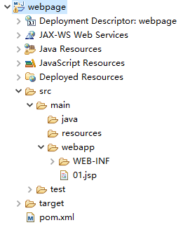
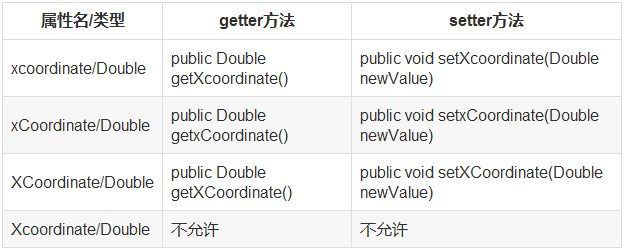

# JavaEE-前端页面

## JSP基础

在Servlet中虽然可以通过输出流向客户端输出网页，当很不方便，更方便的方法是通过JSP。假如把Servlet看作是

Java代码里嵌入HTML，则JSP就是HTML里嵌入Java代码。JSP是Java Server Pages的缩写，是用Java语言编写的服

务器动态页面技术，其文件名必须以`.jsp`结尾，通常JSP文件存放在WEB根目录下，例如：



要在项目中使用JSP，首先

添加依赖：

```xml
	<dependencies>
		<!-- servlet依赖 -->
		<dependency>
			<groupId>javax.servlet</groupId>
			<artifactId>javax.servlet-api</artifactId>
			<version>4.0.0</version>
			<scope>provided</scope>
		</dependency>
		<!-- jsp依赖 -->
		<dependency> 
		   <groupId>javax.servlet.jsp</groupId> 
		   <artifactId>jsp-api</artifactId> 
		   <version>2.1</version> 
		   <scope>provided</scope>
		</dependency>
	</dependencies>
```

第1个JSP页面：

```jsp
<%@ page language="java" contentType="text/html; charset=utf-8"
    pageEncoding="utf-8"%>
<!DOCTYPE html>
<html>
<head>
<meta charset="utf-8">
<title>Insert title here</title>
</head>
<body>
	Hello World
</body>
</html>
```

启动项目访问页面：


### JSP执行过程

当浏览器第1次请求JSP页面时，会经历三个阶段

- 翻译：将JSP翻译成servlet
- 编译：将生成的servlet编译成字节码文件
- 执行：将字节码文件加载到内存中处理请求

后续请求不会再次翻译、编译，而是直接使用内存中加载好的实例；假如JSP页面发生了修改，则修改后的第一次

请求会重新翻译、编译。

翻译后的Servlet位于Tocmat安装目录下的work子目录下：

```java
public final class _01_jsp extends org.apache.jasper.runtime.HttpJspBase
    implements org.apache.jasper.runtime.JspSourceDependent,
                 org.apache.jasper.runtime.JspSourceImports {
  public void _jspInit() {
  }
  public void _jspDestroy() {
  }
  public void _jspService(final javax.servlet.http.HttpServletRequest request, final 			javax.servlet.http.HttpServletResponse response)
      	throws java.io.IOException, javax.servlet.ServletException {
      final javax.servlet.jsp.PageContext pageContext;
      javax.servlet.http.HttpSession session = null;
      final javax.servlet.ServletContext application;
      final javax.servlet.ServletConfig config;
      javax.servlet.jsp.JspWriter out = null;
      final java.lang.Object page = this;
      javax.servlet.jsp.JspWriter _jspx_out = null;
      javax.servlet.jsp.PageContext _jspx_page_context = null;
	  ......
      out.write("\r\n");
      out.write("<!DOCTYPE html>\r\n");
      out.write("<html>\r\n");
      out.write("<head>\r\n");
      out.write("<meta charset=\"utf-8\">\r\n");
      out.write("<title>Insert title here</title>\r\n");
      out.write("</head>\r\n");
      out.write("<body>\r\n");
      out.write("\tHello World\r\n");
      out.write("</body>\r\n");
      out.write("</html>");
      ......
  }
}
```

可以看到其中包含了3个和Servlet类似的方法。

### JSP构成

#### 静态内容

JSP是HTML里面嵌入Java代码，其中的HTML就是其静态内容。

#### 注释

```jsp
<%--这是JSP注释 --%>
```

JSP注释只在JSP源文件中可见，客户端不可见。

#### Java代码片段

在一对`<%  %>`之间可以写任意的Java代码，例如：

```jsp
	<% 
		int i=0;
		System.out.println("i");
	%>
```

翻译成Servlet时，Java代码片段被翻译成`_jspService()`方法内部的一段代码。在java代码片段中可以使用

out、request、response、session、application等一些内置对象。

#### 声明

在一对`<%！  %>`之间可以定义方法或属性，例如：

```jsp
	<%!
    	int count=0;
		public int add(int a,int b){
			return a+b;
		}
	%>
```

声明中的属性会翻译成成员属性，方法会翻译成成员方法。

#### 表达式

在一对`<%= %>`间定义表达式，表达式用来在页面输出数据，例如：

```jsp
	<%=i %>
	<%=add(10,20) %>
```

表达式翻译成`_jspService()`内部的`out.print(）;`语句。

#### 指令

指令的语法：

```jsp
<%@指令名 属性1名=“属性1值”...属性n名=“属性n值”%>
```

常用指令：page指令，taglib指令，include指令，例如：

```jsp
<%--page指令用于设置页面的一些参数 --%>
<%@ page language="java" contentType="text/html; charset=utf-8" pageEncoding="utf-8"%>
<%--taglib指令用于引入标签程序 --%>
<%@taglib uri="http://java.sun.com/jsp/jstl/core" prefix="c" %>
<!DOCTYPE html>
<html>
<head>
<meta charset="utf-8">
<title>Insert title here</title>
</head>
<body>
	<%--include指令用于包含外部文件--%>
	<%@include file="foot.jsp" %>
</body>
</html>
```

#### 动作

动作的语法：

```jsp
<jsp:动作名 属性1名=“属性1值”...属性n名=“属性n值”/>
```

动作中有3个跟JavaBean相关的动作：useBean、setProperty、getProperty

什么是JavaBean？

JavaBean 是一种JAVA语言写成的可重用组件。JavaBean可分为两种：一种是有用户界面（UI，User Interface）的

JavaBean；还有一种是没有用户界面，主要负责处理事务（如数据运算，操纵数据库）的JavaBean。Web应用中通

常使用后一种JavaBean。一个类只要满足3个条件，就可以看作是一个JavaBean：

- 有空参构造
- 实现`Serializable`接口
- 提供属性的公共访问方法

例如：

```java
public class Student implements Serializable{
	private static final long serialVersionUID = 1L;
	private String stuName;
	public Student() {
		super();
	}
	public Student(String stuName) {
		super();
		this.stuName = stuName;
	}
	public String getStuName() {
		return stuName;
	}
	public void setStuName(String stuName) {
		this.stuName = stuName;
	}
}
```

JavaBean的属性与公共访问方法的方法名有关，而与成员变量的名字无关，在JavaBean规范中是这样规定的：



假如将上面代码中的成员变量名改变，而公共访问方法的名称不变，其属性名仍然是原来的名字，例如：

```java
public class Student implements Serializable{
	private static final long serialVersionUID = 1L;
	private String name;//成员变量名变化
	public Student() {
		super();
	}
	public Student(String stuName) {
		super();
		this.name = stuName;
	}
	public String getStuName() {//公共访问方法的名称不变
		return name;
	}
	public void setStuName(String stuName) {//公共访问方法的名称不变
		this.name = stuName;
	}
}
```

此时，在页面可以使用动作创建这个JavaBean的实例并访问：

```jsp
	<%-- 创建Student的实例--%>
	<jsp:useBean id="stu" class="com.study.Student"></jsp:useBean>
	<%-- 给属性stuName赋值 --%>
	<jsp:setProperty name="stu" property="stuName" value="tom"/>
	<%-- 访问属性stuName --%>
	<jsp:getProperty name="stu" property="stuName"/>
```

输出：tom，假如将`property`属性设置为`name`，会报找不到`name`属性的错误：

```txt
org.apache.jasper.JasperException: 在[com.study.Student]类型bean中找不到任何有关属性[name]的信息
```


## JSP 隐式对象

JSP隐式对象是JSP容器为每个页面提供的Java对象，开发者可以直接使用它们而不用显式声明。JSP隐式对象也被称为预定义变量。

JSP所支持的九大隐式对象：

| **对象**    | **描述**                                                     |
| :---------- | :----------------------------------------------------------- |
| request     | **HttpServletRequest** 接口的实例                            |
| response    | **HttpServletResponse** 接口的实例                           |
| out         | **JspWriter**类的实例，用于把结果输出至网页上                |
| session     | **HttpSession**类的实例                                      |
| application | **ServletContext**类的实例，与应用上下文有关                 |
| config      | **ServletConfig**类的实例                                    |
| pageContext | **PageContext**类的实例，提供对JSP页面所有对象以及命名空间的访问 |
| page        | 类似于Java类中的this关键字                                   |
| Exception   | **Exception**类的对象，代表发生错误的JSP页面中对应的异常对象 |


## JSP 表达式语言

JSP表达式语言（EL）使得访问存储在JavaBean中的数据变得非常简单。JSP EL既可以用来创建算术表达式也可以用来创建逻辑表达式。在JSP EL表达式内可以使用整型数，浮点数，字符串，常量true、false，还有null。

典型的，当您需要在JSP标签中指定一个属性值时，只需要简单地使用字符串即可：

~~~properties
<jsp:setProperty name="box" property="perimeter" value="100"/>
~~~

JSP EL允许您指定一个表达式来表示属性值。一个简单的表达式语法如下：

~~~pro
${expr}
~~~

其中，expr指的是表达式。在JSP EL中通用的操作符是 **.** 和 **{}** 。这两个操作符允许您通过内嵌的JSP对象访问各种各样的JavaBean属性。


EL中的基础操作符

EL表达式支持大部分Java所提供的算术和逻辑操作符：

| **操作符** | **描述**                         |
| :--------- | :------------------------------- |
| .          | 访问一个Bean属性或者一个映射条目 |
| []         | 访问一个数组或者链表的元素       |
| ( )        | 组织一个子表达式以改变优先级     |
| +          | 加                               |
| -          | 减或负                           |
| *          | 乘                               |
| / or div   | 除                               |
| % or mod   | 取模                             |
| == or eq   | 测试是否相等                     |
| != or ne   | 测试是否不等                     |
| < or lt    | 测试是否小于                     |
| > or gt    | 测试是否大于                     |
| <= or le   | 测试是否小于等于                 |
| >= or ge   | 测试是否大于等于                 |
| && or and  | 测试逻辑与                       |
| \|\| or or | 测试逻辑或                       |
| ! or not   | 测试取反                         |
| empty      | 测试是否空值                     |


JSP EL隐含对象

JSP EL支持下表列出的隐含对象：

| **隐含对象**     | **描述**                      |
| :--------------- | :---------------------------- |
| pageScope        | page 作用域                   |
| requestScope     | request 作用域                |
| sessionScope     | session 作用域                |
| applicationScope | application 作用域            |
| param            | Request 对象的参数，字符串    |
| paramValues      | Request对象的参数，字符串集合 |
| header           | HTTP 信息头，字符串           |
| headerValues     | HTTP 信息头，字符串集合       |
| initParam        | 上下文初始化参数              |
| cookie           | Cookie值                      |
| pageContext      | 当前页面的pageContext         |


## JSP 标准标签库（JSTL）

JSP标准标签库（JSTL）是一个JSP标签集合，它封装了JSP应用的通用核心功能。

JSTL支持通用的、结构化的任务，比如迭代，条件判断，XML文档操作，国际化标签，SQL标签。 除了这些，它还提供了一个框架来使用集成JSTL的自定义标签。

根据JSTL标签所提供的功能，可以将其分为5个类别。

- **核心标签**
- **格式化标签**
- **SQL 标签**
- **XML 标签**
- **JSTL 函数**


JSTL 库安装

Apache Tomcat安装JSTL 库步骤如下：

从Apache的标准标签库中下载的二进包(jakarta-taglibs-standard-current.zip)。

- 官方下载地址：http://archive.apache.org/dist/jakarta/taglibs/standard/binaries/

下载 **jakarta-taglibs-standard-1.1.2.zip** 包并解压，将 **jakarta-taglibs-standard-1.1.2/lib/** 下的两个 jar 文件：**standard.jar** 和 **jstl.jar** 文件拷贝到 **/WEB-INF/lib/** 下。

将 tld 下的需要引入的 tld 文件复制到 WEB-INF 目录下。


核心标签

核心标签是最常用的 JSTL标签。引用核心标签库的语法如下：

~~~pro
<%@ taglib prefix="c" uri="http://java.sun.com/jsp/jstl/core" %>
~~~


核心标签库


格式化标签库

<fmt:formatNumber >标签用于格式化数字，百分比，货币。

| **属性**          | **描述**                           | **是否必要** | **默认值**     |
| :---------------- | :--------------------------------- | :----------- | :------------- |
| value             | 要显示的数字                       | 是           | 无             |
| type              | NUMBER，CURRENCY，或 PERCENT类型   | 否           | Number         |
| pattern           | 指定一个自定义的格式化模式用与输出 | 否           | 无             |
| currencyCode      | 货币码（当type="currency"时）      | 否           | 取决于默认区域 |
| currencySymbol    | 货币符号 (当 type="currency"时)    | 否           | 取决于默认区域 |
| groupingUsed      | 是否对数字分组 (TRUE 或 FALSE)     | 否           | true           |
| maxIntegerDigits  | 整型数最大的位数                   | 否           | 无             |
| minIntegerDigits  | 整型数最小的位数                   | 否           | 无             |
| maxFractionDigits | 小数点后最大的位数                 | 否           | 无             |
| minFractionDigits | 小数点后最小的位数                 | 否           | 无             |
| var               | 存储格式化数字的变量               | 否           | Print to page  |
| scope             | var属性的作用域                    | 否           | page           |

~~~html
<body>
<h3>数字格式化:</h3>
<c:set var="balance" value="120000.2309" />
<p>格式化数字 (1): <fmt:formatNumber value="${balance}" 
            type="currency"/></p>
<p>格式化数字 (2): <fmt:formatNumber type="number" 
            maxIntegerDigits="3" value="${balance}" /></p>
<p>格式化数字 (3): <fmt:formatNumber type="number" 
            maxFractionDigits="3" value="${balance}" /></p>
<p>格式化数字 (4): <fmt:formatNumber type="number" 
            groupingUsed="false" value="${balance}" /></p>
<p>格式化数字 (5): <fmt:formatNumber type="percent" 
            maxIntegerDigits="3" value="${balance}" /></p>
<p>格式化数字 (6): <fmt:formatNumber type="percent" 
            minFractionDigits="10" value="${balance}" /></p>
<p>格式化数字 (7): <fmt:formatNumber type="percent" 
            maxIntegerDigits="3" value="${balance}" /></p>
<p>格式化数字 (8): <fmt:formatNumber type="number" 
            pattern="###.###E0" value="${balance}" /></p>
<p>美元 :
<fmt:setLocale value="en_US"/>
<fmt:formatNumber value="${balance}" type="currency"/></p>
~~~


<fmt:formatDate > 标签用于使用不同的方式格式化日期。

| 属性      | 描述                                  | 是否必要 | 默认值     |
| :-------- | :------------------------------------ | :------- | :--------- |
| value     | 要显示的日期                          | 是       | 无         |
| type      | DATE, TIME, 或 BOTH                   | 否       | date       |
| dateStyle | FULL, LONG, MEDIUM, SHORT, 或 DEFAULT | 否       | default    |
| timeStyle | FULL, LONG, MEDIUM, SHORT, 或 DEFAULT | 否       | default    |
| pattern   | 自定义格式模式                        | 否       | 无         |
| timeZone  | 显示日期的时区                        | 否       | 默认时区   |
| var       | 存储格式化日期的变量名                | 否       | 显示在页面 |
| scope     | 存储格式化日志变量的范围              | 否       | 页面       |

~~~html
<body>
<h3>日期格式化:</h3>
<c:set var="now" value="<%=new java.util.Date()%>" />

<p>日期格式化 (1): <fmt:formatDate type="time" 
            value="${now}" /></p>
<p>日期格式化 (2): <fmt:formatDate type="date" 
            value="${now}" /></p>
<p>日期格式化 (3): <fmt:formatDate type="both" 
            value="${now}" /></p>
<p>日期格式化 (4): <fmt:formatDate type="both" 
            dateStyle="short" timeStyle="short" 
            value="${now}" /></p>
<p>日期格式化 (5): <fmt:formatDate type="both" 
            dateStyle="medium" timeStyle="medium" 
            value="${now}" /></p>
<p>日期格式化 (6): <fmt:formatDate type="both" 
            dateStyle="long" timeStyle="long" 
            value="${now}" /></p>
<p>日期格式化 (7): <fmt:formatDate pattern="yyyy-MM-dd" 
            value="${now}" /></p>

</body>
~~~


JSTL函数

JSTL包含一系列标准函数，大部分是通用的字符串处理函数。引用JSTL函数库的语法如下：

| 函数                    | 描述                                                     |
| :---------------------- | :------------------------------------------------------- |
| fn:contains()           | 测试输入的字符串是否包含指定的子串                       |
| fn:containsIgnoreCase() | 测试输入的字符串是否包含指定的子串，大小写不敏感         |
| fn:endsWith()           | 测试输入的字符串是否以指定的后缀结尾                     |
| fn:escapeXml()          | 跳过可以作为XML标记的字符                                |
| fn:indexOf()            | 返回指定字符串在输入字符串中出现的位置                   |
| fn:join()               | 将数组中的元素合成一个字符串然后输出                     |
| fn:length()             | 返回字符串长度                                           |
| fn:replace()            | 将输入字符串中指定的位置替换为指定的字符串然后返回       |
| fn:split()              | 将字符串用指定的分隔符分隔然后组成一个子字符串数组并返回 |
| fn:startsWith()         | 测试输入字符串是否以指定的前缀开始                       |
| fn:substring()          | 返回字符串的子集                                         |
| fn:substringAfter()     | 返回字符串在指定子串之后的子集                           |
| fn:substringBefore()    | 返回字符串在指定子串之前的子集                           |
| fn:toLowerCase()        | 将字符串中的字符转为小写                                 |
| fn:toUpperCase()        | 将字符串中的字符转为大写                                 |
| fn:trim()               | 移除首尾的空白符                                         |


## mvc架构模式


V：view（试图），一般是指jsp呈现给用户的页面
C：Controller（控制器），指servlet接收响应并处理客户端（浏览器，jsp页面）发来的请求。
M: model（模型），是指javabean（就是一个普通类，但是要符合一些规范，这样就可以应用一些工具类）。

将这3部分分开后，他们各司其职，结构清晰，有利于开发。
