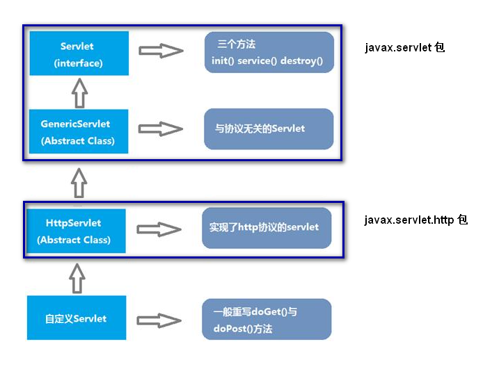
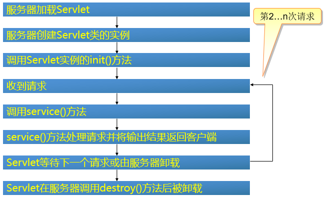
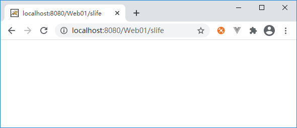
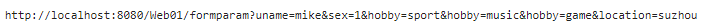
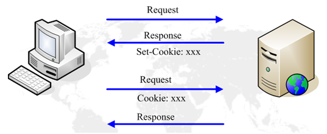
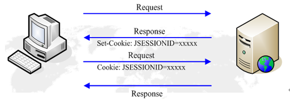
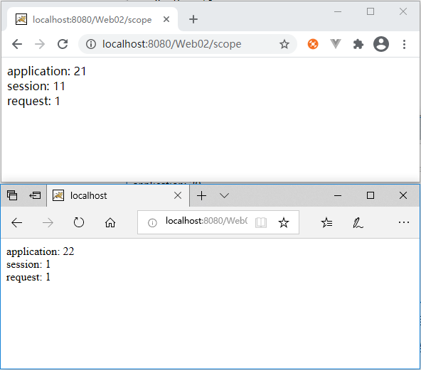
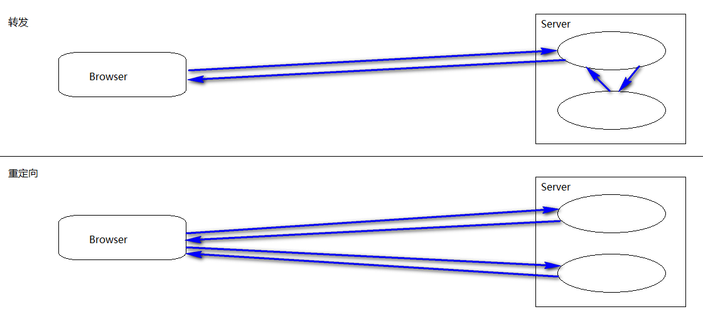

# JavaEE-Servlet

## tomcat环境搭建

自定义的Servlet不能直接运行，必须运行在Servlet容器中，因此，首先要安装一个支持Servlet API的Web服务器。

常用的服务器有：

- **Tomcat**：由Apache开发的开源免费服务器
- **Jetty**：由Eclipse开发的开源免费服务器
- **GlassFish**：由SUN开发的开源免费服务器

另外还有一些收费的商用服务器，如Oracle的**WebLogic**，IBM的**WebSphere**。

这里选择使用最广泛的开源免费的Tomcat服务器。

### 单独使用

首先下载Tomcat服务器，解压后目录结构如下：


其中：

- bin：包含了服务器的启动文件：startup.bat（windows）、startup.sh（Linux）
- conf：配置文件
- lib：项目所需jar包可以放在此目录下
- logs：存放日志文件
- temp：临时目录
- webapps：用户的项目发布目录
- work：存放jsp翻译后的源码文件

进入bin目录，双击执行startup.bat（需正确的配置环境变量JAVA_HOME）启动Tomcat。


看到启动成功的信息后，可以打开浏览器，在地址栏输入http://localost:8080进行测试：


### 与Eclipse集成

首先window下拉菜单中选择Preferences，进入配置界面：


单击Add，进入添加界面：


单击Browse，选择Tomcat的安装目录：


单击Finish结束配置。windows下拉菜单中选择Show View，打开Servers视图，**双击**服务器，显示配置页面，

发布位置选择第2个选项：Use Tomcat installation；发布路径选择Tomcat安装目录下的webapps：


选中服务器，单击右键，选择Start：


在控制台看到启动信息：


测试方法同上。

## 测试Web项目

### 建立项目

建立一个Maven项目，在pom.xml中添加servlet-api的依赖：

```xml
<project xmlns="http://maven.apache.org/POM/4.0.0"
	xmlns:xsi="http://www.w3.org/2001/XMLSchema-instance"
	xsi:schemaLocation="http://maven.apache.org/POM/4.0.0 
                        https://maven.apache.org/xsd/maven-4.0.0.xsd">
	<modelVersion>4.0.0</modelVersion>
	<groupId>com.study</groupId>
	<artifactId>webdemo</artifactId>
	<version>0.0.1-SNAPSHOT</version>
	<packaging>war</packaging>
	<dependencies>
		<dependency>
			<groupId>javax.servlet</groupId>
			<artifactId>javax.servlet-api</artifactId>
			<version>4.0.0</version>
			<scope>provided</scope>
		</dependency>
	</dependencies>
	<build>
		<finalName>webdemo</finalName>
		<plugins>
			<plugin>
				<groupId>org.apache.maven.plugins</groupId>
				<artifactId>maven-compiler-plugin</artifactId>
				<version>3.1</version>
				<configuration>
					<source>1.8</source>
					<target>1.8</target>
				</configuration>
			</plugin>
		</plugins>
	</build>
</project>
```

这个`pom.xml`与普通Java项目的区别，打包类型不是`jar`而是`war`，表示Java Web Application Archive。

`sevlet-api`依赖的`<scope>`指定为`provided`，表示编译时使用，但不会打包到`.war`文件中，因为运行

时服务器已经提供了Servlet API相关的jar包。默认生成的目录结构还不完整，需要手动创建补全：

在`src/main`下创建一个子目录`/webapp`，这个目录代表`web`根目录，项目中用到的`js`、`css`、图片、页面

等均放置在此目录下，在`/webapp`下再创建一个子目录`/WEB-INF`，此`/WEB-INF`目录下需要创建一个文件

`web.xml`，用来对项目进行配置，`/WEB-INF`下还需一个`/lib`子目录，用来存放项目中用到的`jar`文件，

这些目录结构是固定的：


web.xml文件内容如下：

```xml
<?xml version="1.0" encoding="UTF-8"?>
<web-app xmlns:xsi="http://www.w3.org/2001/XMLSchema-instance"
	xmlns="http://xmlns.jcp.org/xml/ns/javaee"
	xsi:schemaLocation="http://xmlns.jcp.org/xml/ns/javaee 	
                        http://xmlns.jcp.org/xml/ns/javaee/web-app_3_1.xsd"
	version="3.1">
	<welcome-file-list>
		<welcome-file>index.html</welcome-file>
	</welcome-file-list>
</web-app>
```

其中配置的`welcome-file`表示访问项目时的默认页面（可不写页面名称）。

在`/webapp`下建立index.html，内容如下：

```html
<!DOCTYPE html>
<html>
	<head>
		<meta charset="utf-8" />
		<title>Web</title>
	</head>
	<body>
		Hello World
	</body>
</html>
```

### 发布/运行项目

#### 命令行打包

在项目根目录下，执行Maven命令：

```maven
mvn clean package
```

在`target`目录下得到一个`webdemo.war`文件，这个文件就是编译打包后的Web应用程序。将此文件拷贝到

`Tomcat`安装目录下的`/webapps`下，然后启动`Tomcat`，启动成功后打开浏览器访问：


#### 使用Eclipse发布

选中项目，在鼠标右键菜单中选择`Run on Server`，选择服务器并运行：


### 发布项目的目录结构

无论源代码项目采用什么目录结构，发布到服务器`/webapps`下的发布项目，其目录结构是固定的：

下图中，webdemo是`web`根目录的名字，根目录下存放`js`、`css`、图片、页面：


`/WEB-INF`下存放项目描述文件`web.xml`，`/lib`下存放项目用到的jar包，`/classes`下存放项目中的java源码

编译后的字节码文件：


`/META-INF`相当于一个信息包，用来配置应用程序、扩展程序、类加载器和服务文件，打包时自动生成。


## Servlet简介

Servlet是Server Applet的简称，简称服务器端小程序，是用Java编写的服务器端程序，具有独立于平台和协议的

特性，主要功能在于处理客户端发出的请求、生成动态内容返回给客户端，其过程为：

1. 客户端发送请求至服务器端
2. 服务器将请求信息发送至 Servlet
3. Servlet 生成响应内容并将其传给服务器
4. 服务器将响应返回给客户端

Servlet程序不能单独运行，必须运行在Servlet容器中（例如：Tomcat）。

### Servlet体系结构



Servlet接口：定义了所有Servlet都必须实现的方法

GenericServlet：Servlet接口的实现类，定义了通用的、协议无关的Servlet

HttpServlet：GenericServlet的子类，定义了基于Http协议的Servlet

自定义Servlet：通常直接继承HttpServlet并重写其中的方法

### Servlet生命周期



其生命周期可以归纳为三个阶段：初始化、服务、销毁。Servlet第1次被访问时，Servlet容器将其加载到内存中，

调用`init()`方法对其进行初始化，然后调用其`service()`方法对请求进行处理，并生成响应返回给用户，然后

此Servlet一直驻留在内存中，等待处理下一次请求，接受到下一次请求时，直接调用`service()`方法对其进行处

理，假如此Servlet长时间没有被访问，Servlet容器就会将其从内存中卸载（取决于容器的具体实现），卸载时将

会调用`destroy()`方法，在一个生命周期中，`init()`和`destroy()`方法都只会调用1次，而`service()`方法

可能被调用多次。

## Servlet基本应用

### Servlet定义

通常，自定义Servlet继承至HttpServlet，例如：

```java
public class LifeServlet extends HttpServlet{
	@Override
	public void init() throws ServletException {
		System.out.println("init");
	}
	@Override
	protected void service(HttpServletRequest request, HttpServletResponse response) 
			throws ServletException, IOException {
		System.out.println("service");
	}
	@Override
	public void destroy() {
		System.out.println("destroy");
	}
}
```

### Servlet配置

对项目中的静态资源（页面、图片等），通过其相对于web根目录的相对路径就可以访问，其访问路径如下：

```txt
协议://服务器IP：端口号/web根目录的名字/相对路径
```

对于Servlet，其访问路径需要进行配置，其配置方式有2种：

- xml配置文件

  在/WEB-INF/web.xml中添加如下配置：

  ```xml
    <servlet>
    	<!-- 别名 -->
    	<servlet-name>life</servlet-name>
    	<!-- Servlet的完全限定名 -->
    	<servlet-class>com.study.LifeServlet</servlet-class>
    </servlet>
    <servlet-mapping>
    	<!-- 别名,与上面的相同 -->
    	<servlet-name>life</servlet-name>
    	<!-- 访问地址,通常以/开头 -->
    	<url-pattern>/slife</url-pattern>
    </servlet-mapping>
  ```

  其中的`url-patten`设置的就是其访问路径，其完整的访问路径如下：

  ```txt
  协议://服务器IP：端口号/web根目录的名字/url-pattern中的配置路径
  ```

  一个`servlet`标签可以对应多个`servlet-mapping`，也就是1个Servlet可以有多个不同的访问路径，

  打开浏览器，进行测试：

  

  因为此Servlet未向客户端输出任何内容，所以在浏览器窗口看不到任何信息，在控制台，能看到如下输出：

  ```txt
  init
  service
  ```

  这说明servlet第1次被访问时，会先调用`init()`，然后调用`service()`，再多次刷新浏览器，每次刷新在服

  务器控制台都会输出一次service，说明后续访问直接调用`service()`进行处理，此时停止服务器，服务器在

  停止时会卸载当前发布的项目，此时在控制台就能看到`destroy()`方法被调用。

- 注解

  在类名上添加@WebServlet注解：

  ```java
  //@WebServlet(urlPatterns = {"/slife","/other"}) //映射到多个路径
  //@WebServlet(urlPatterns = "/slife")//映射到一个路径
  @WebServlet("/slife")//简化写法
  public class LifeServlet extends HttpServlet
  ```

  显然，注解的方式更加便捷，需要注意的是，这2种方式不能共存，只能使用其中1种；通常，自己定义的

  Servlet采用注解，而使用第三方提供的Servlet则需使用xml配置文件。

### Servlet访问

前面的例子中，通过在地址栏输入地址直接访问某个Servlet，这种方式可以用来进行测试，实际应用中更多是通

过操作网页元素来访问，常见的方式有：

- 超链接：在超链接的href属性设置访问路径，例如：

  ```html
  <a href="http://localhost:8080/Web01/slife">完整路径</a><br/>
  <a href="/Web01/slife">绝对路径</a><br/>
  <a href="slife">相对路径</a><br/>
  ```

  相对路径的基准会随着页面位置的变化而变化，不推荐使用，完整路径太过繁琐，推荐使用绝对路径的写法。

- 表单：在form标签的action属性中设置访问路径，就能访问到响应的Servlet，例如：

  ```html
  <form action="/Web01/slife" method="post">
  ```

- JS脚本：在ajax请求或者location的跳转方法中指定路径，例如：

  ```javascript
  location.replace("/Web01/slife");
  ```

### doGet/doPost

在上面的例子中，重写了`service()`方法，但实际应用中通常无需重写此方法，因为HttpServlet的`service()`

方法并非空实现，其实现了接受请求，并将请求转发给一系列`doXxx()`方法的功能，所以这一系列`doXxx()`方

法才是需要重写的方法，最常见的就是`doGet()`和`doPost()`，`doGet()`用来处理Get方式发出的请求，

`doPost()`用来处理Post方式发出的请求。在前端，ajax请求中可以指定是Get方式还是Post方式，页面中，只有

使用表单并且设置了method为Post时是Post方式，其它情况都是Get方式。

#### Get和Post的区别

1. Get方式将请求参数组装后放在请求行URI的后面，在地址栏可见，Post方式将请求参数组装后放在请求的正

   文部分，地址栏不可见。

2. Get方式因为参数可见，所以不安全，Post方式相对安全

3. Get方式在地址栏能够传递的参数是有长度限制的（跟具体的浏览器相关），Post方式无限制

4. Get方式用于从服务器获取数据，Post方式用于向服务器提交数据

`doGet()`和`doPost()`方法都有2个参数：`HttpServletRequest`，`HttpServletResponse`

#### 获取请求参数

`HttpServletRequest`继承于`ServletRequest`，代表请求，其中定义了获取参数的几个方法：

- **String getParameter(String name)：**根据参数名获取参数的值
- **String[] getParameterValues(String name)：**如果存在同名参数时使用，返回String数组（例如复选框）
- **Enumeration getParameterNames()：**获得当前请求中的所有参数的枚举

浏览器进行参数组装时，会将表单元素的name属性作为参数名，将表单元素的value属性作为参数值，例如：

```html
	<form action="/Web01/formparam" method="post">
		<input type="text" name="uname" value="mike"/><br/>
		<input type="radio" name="sex" value="1" checked="checked"/>男
		<input type="radio" name="sex" value="0"/>女<br/>
		<input type="checkbox" name="hobby" value="sport" checked="checked"/>体育
		<input type="checkbox" name="hobby" value="music" checked="checked"/>音乐
		<input type="checkbox" name="hobby" value="game" checked="checked"/>游戏<br/>
		<select name="location">
			<option value="nanjing">南京</option>
			<option value="suzhou" selected="selected">苏州</option>
			<option value="wuxi">无锡</option>
		</select><br/>
		<input type="submit" value="提交"/>
	</form>
```

表单以Post方式提交，且编码类型是`application/x-www-form-urlencoded`时，发送参数称之为Form Data：


Form Data会放在请求的正文部分

表单以Get方式提交时，发送参数称之为Query String：


QueryString会附加在URI的后面，放在请求行



获取Form Data、QueryString中参数的代码：

```java
		String queryString=request.getQueryString();//获取整个QueryString,Post方式时为null
		String un=request.getParameter("uname");//获取单一参数
		String sex=request.getParameter("sex");
		String loc=request.getParameter("location");
		String[] hobby=request.getParameterValues("hobby");//获取一组同名参数
```

#### 返回响应内容

`HttpServletResponse`继承于`ServletResponse`，代表响应。

要向客户端响应网页信息，先要获取字符打印流：`PrintWriter`：

- **public java.io.PrintWriter getWriter() throws java.io.IOException**

然后通过其向客户端输出网页代码。

例如：

```java
		response.setContentType("text/html");//告诉浏览器返回的是网页
		PrintWriter out=response.getWriter();//获得字符打印流
		out.print(un+"<br/>");
		out.print(sex+"<br/>");
		out.print(loc+"<br/>");
		if(hobby!=null){
			for(String s:hobby){
				out.print(s+";");
			}
		}
		out.flush();//清空缓存
		out.close();
```

#### 中文处理

默认情况下，浏览器在发送请求前会对请求参数进行编码，编码采用的字符集根据网页中的mate头决定，例如：

```html
<!DOCTYPE html>
<html>
    <head>
        <meta charset="utf-8">
        <title>测试网页</title>
    </head>
    <body>
        <form action="/Web03/encode" method="post">
            <input type="text" name="name" value="中国"/>
            <input type="submit" value="测试"/>
        </form>
    </body>
</html>
```

提交数据将会编码成：

```txt
name=%E4%B8%AD%E5%9B%BD
```

假如改成：

```html
<meta charset="GBK">
```

则会编码成：

```txt
name=%D6%D0%B9%FA
```

当使用`getParameter()`方法获取参数时，会对参数值进行解码，默认解码的字符集是ISO-8859-1，不支持中

文，如要正确的解码，则要设置与编码相同的字符集：

```java
request.setCharacterEncoding(“utf-8”);//设置从请求中取参时候的解码字符集
```

需要注意的是，应该在取参之前设置解码字符集。

在将响应内容输出给浏览器时，也会对内容进行编码，默认字符集也是ISO-8859-1，假如响应内容中包含中文，

则不能正确处理，此时需要设置编码字符集：

```java
response.setCharacterEncoding(“utf-8”);//设置对响应内容编码采用的字符集
```

这句代码应该写在输出响应内容之前。

浏览器接受到响应内容后，会对响应内容进行解码，然后呈现在浏览器界面上，如果响应内容中包含中文，应该在

响应头中添加Content-Type头，告知浏览器采用何种字符集进行解码：

```java
response.setContentType("text/html;charset=utf-8");
```

完整代码：

```java
	protected void doPost(HttpServletRequest request, HttpServletResponse response) 	
        throws ServletException, IOException {
		request.setCharacterEncoding(“utf-8”);//设置从请求中取参时候的解码字符集
		response.setCharacterEncoding(“utf-8”);//设置对响应内容编码采用的字符集
    	//在响应头中添加Content-Type:告诉浏览器返回内容的类型及编码
		response.setContentType("text/html;charset=utf-8”);
		String data=request.getParameter("name");//解码默认字符集:ISO-8859-1
		System.out.println(data);
		PrintWriter out=response.getWriter();
		out.print(data);//采用默认编码字符集:ISO-8859-1
		out.flush();
		out.close();
	}
```

以上代码中，将字符集直接固化在代码中，如需换成另一种字符集，则需修改代码，此时可以考虑在Servlet初始

化时将字符集传入。

### ServletConfig接口

假如用户希望在加载Servlet时，能够传入一些参数对Servlet进行初始化，此时需要用到`ServletConfig`对象。

具体的实现分2步：

- 首先对初始化参数进行配置（可以使用xml文件也可以使用注解），Servlet容器在初始化阶段将会读取这些配

  置信息并将这些信息组装到`ServletConfig`对象中

- 在`init()`方法中通过`ServletConfig`对象的`getInitParameter()`方法根据参数名获得参数值：

  - **public java.lang.String getInitParameter(java.lang.String name)**

  `ServletConfig`对象可以通过从`GenericServlet`继承的`getServletConfig()`方法获取

  - **public ServletConfig getServletConfig()**

例如，使用配置文件：

```xml
    <servlet>
        <servlet-name>code</servlet-name>
        <servlet-class>com.study.CodeServlet</servlet-class>
        <init-param>
          <param-name>encode</param-name>
          <param-value>utf-8</param-value>
        </init-param>
    </servlet>
```

在`servlet`标签内使用`init-param`子标签进行设置，假如有多个参数则设置多个`init-param`，这种方式配

置的初始化参数是这个Servlet独有的，其它Servlet访问不到。

使用注解：

```java
@WebServlet(urlPatterns="/encode",initParams={
		@WebInitParam(name="encode",value="utf-8")
})
public class CodeServlet extends HttpServlet {}
```

需要注意的是，xml配置文件和注解二者不能共存。配置好后，在`init()`方法中通过ServletConfig对象根据参数

名获取参数值，例如：

```java
public class CodeServlet extends HttpServlet {
	private String code;
	@Override
	public void init() throws ServletException {
		super.init();
		ServletConfig config=this.getServletConfig();
		code=config.getInitParameter("encode");
	}
	protected void doPost(HttpServletRequest request, HttpServletResponse response) 
        throws ServletException, IOException {
		request.setCharacterEncoding(code);//设置从请求中取参时候的解码字符集
		response.setCharacterEncoding(code);//设置对响应内容编码采用的字符集
        //在响应头中添加Content-Type:告诉浏览器返回内容的类型及编码
		response.setContentType("text/html;charset="+code);
		String data=request.getParameter("name");//解码默认字符集:ISO-8859-1
		System.out.println(data);
		PrintWriter out=response.getWriter();
		out.print(data);//采用默认编码字符集:ISO-8859-1
		out.flush();
		out.close();
	}
}
```

### ServletContext接口

Servlet上下文对象定义了一系列Servlet与其所处的Servlet容器交互的方法，例如：将请求转发给另一个Servlet，

获取指定目录在服务器的绝对路径等，一个JVM中，一个应用的所有Servlet共享一个上下文。可以将Servlet上下

文理解成Servlet所处的环境对象，假如将一个教室内的每个学生都看作一个Servlet，那么这个教室就相当于

Servlet上下文。在web.xml中可以配置上下文参数，上下文参数在每个Servlet都可以访问，例如：

```xml
      <context-param>
        <param-name>user</param-name>
        <param-value>root</param-value>
      </context-param>
      <servlet>
          ......
      </servlet>
```

`context-param`是与`servlet`并列的标签，如有多个上下文参数则设置多个`context-param`，

在代码中，先通过从`GenericServlet`继承的`getServletContext()`方法获取`ServletContext`：

- **public ServletContext getServletContext()**

再通过`ServletContext`的`getInitParameter()`方法根据参数名获得参数值：

- **public java.lang.String getInitParameter(java.lang.String name)**

例如：

```java
	private String user;
	@Override
	public void init() throws ServletException {
		ServletContext context=this.getServletContext();//获得ServletContext
		user=context.getInitParameter("user");//获得上下文参数
	}
```

### JSON数据处理

请求页面：

```html
	<input type="button" value="jsonData" onclick="sendData()" />
	<script>
		function sendData() {
			$.ajax({
				url : "/webdemo/jsonparam",
				contentType : "application/json;charset=utf-8",
				type : "post",
				data:JSON.stringify({userName:"mike", userAge:"20",birth:"2020-01-01"}),
				dataType:"json",
				success : function(data) {
					console.log(data);
				}
			});
		}
	</script>
```

当请求的Content-Type设置为`application/json;charset=urf-8`时，发送参数称之为Request Payload：


在Servlet中通过`getParameter()`方法不能正确的获取参数信息，正确获取参数的方式如下：

首先，在pom.xml中添加fastjson的依赖：

```xml
		<dependency>
		    <groupId>com.alibaba</groupId>
		    <artifactId>fastjson</artifactId>
		    <version>1.2.62</version>
		</dependency>
```

在Servlet中，使用fastjson提供的API获取参数信息：

```java
		BufferedReader reader=request.getReader();//获得参数的输入流
		StringBuffer jsonData=new StringBuffer("");
		String data=reader.readLine();
		while(data!=null) {//通过循环读取json数据
			jsonData.append(data);
			data=reader.readLine();
		}
		//输出：{"userName":"mike","userAge":"20","birth":"2020-01-01"}
		System.out.println(jsonData.toString());
		//Json字符串转换成为对象
		User user = JSON.parseObject(jsonData.toString(), User.class);
		//输出：User [userAge=20, userName=mike, birth=Wed Jan 01 00:00:00 CST 2020]
		System.out.println(user);
```

User类：

```java
public class User {
	private Integer userAge;
	private String userName;
	 @JSONField(format="yyyy-MM-dd")//设置时间类型的转换格式
	private Date birth;
	......
}

```

返回单个JSON数据：

```java
		response.setContentType("text/html;charset=utf-8");
		PrintWriter out=response.getWriter();
		User returnData=new User("tom",22);
		out.print(JSONObject.toJSONString(returnData));//将对象转成JSON格式的字符串
		out.flush();
		out.close();
```

返回结果：

```txt
{"birth":"2021-01-07","userAge":22,"userName":"tom"}
```

返回JSON数组：

```java
		response.setContentType("text/html;charset=utf-8");
		PrintWriter out=response.getWriter();
		User u1=new User("用户1",21);
		User u2=new User("用户2",22);
		User u3=new User("用户3",23);
		List<User> list=new ArrayList<>();
		list.add(u1);
		list.add(u2);
		list.add(u3);
		out.print(JSONArray.toJSONString(list));//将集合组装成JSON格式的数组
		out.flush();
		out.close();
```

返回结果：

```txt
[
	{"birth":"2021-01-07","userAge":21,"userName":"用户1"},
	{"birth":"2021-01-07","userAge":22,"userName":"用户2"},
	{"birth":"2021-01-07","userAge":23,"userName":"用户3"}
]
```

## 会话跟踪

HTTP协议是一个无状态协议，不会对客户端进行标识，其无法区分接受的2个请求是2个用户各访问了一次，还是

同一个客户访问了2次；而在实际应该用中，经常要记住当前用户的信息，以便后续操作的进行（例如OA系统中不

同的用户具有不同的权限，是否有某个权限就要根据当前的用户信息来判断），会话跟踪就能实现此功能。

### Cookie

Cookie是由服务器发送给浏览器，由浏览器保存在客户端的一个文本文件（也可能只存在于浏览器内存里，浏览

器关闭时销毁），Cookie只要没有过期，其中的内容会被浏览器读取并发送给服务器。Cookie通常用以存储少量

客端的信息（例如：登录信息，个人偏好），其包含一个名字、一个值以及其它一些可选信息（例如：过期时间、

路径、域名等）。



获取当前请求中所有Cookie的方法定义在接口`HttpServletRequest`中：

- **public Cookie[] getCookies()**：获得当前请求中所有的cookie，不存在则返回`null`

向浏览器添加一个Cookie的方法定义在接口`HttpServletResponse`中：

- **public void addCookie(Cookie cookie)**：将指定的Cookie添加到响应中

`Cookie`的构造：

- **Cookie(String name，String value)**：传入名字和值构造一个Cookie对象

`Cookie`的方法：

- **public void setDomain(String pattern)**：设置 cookie 适用的域

- **public void setMaxAge(int expiry)** ：设置 cookie 过期的时间（以秒为单位）。设置为0则删除Cookie，设置为

  负数则Cookie不会保存成文件而仅存在于浏览器内存中，浏览器关闭时删除。

- **public String getName()**：返回 cookie 的名称

- **public String getValue()**：返回 cookie 的值

- **public void setPath(String uri)** ：设置 cookie 适用的路径。默认不设置path的时候，只会在请求和添加路径相

  同的情况下才会携带cookie，包含同级目录和下级目录，例如：

  在`http://localhost:8080/Web02/test/save`中通过addCookie添加的cookie，

  在访问`http://localhost:8080/Web02/test/test.html`和`http://localhost:8080/Web02/test/test/test.html`时都会携带此cookie，

  在访问`http://localhost:8080/Web02/test2/test.html`时则不会携带。

- **public void setSecure(boolean flag)** ：表示 cookie 是否应该只在加密的（即 SSL）连接上发送。

添加Cookie：

```java
		//构造Cookie对象
		Cookie c=new Cookie("age","22");
		c.setPath("/");//设置Cookie的适用路径，"/"和"/"的所有子目录都会携带此cookie
		c.setMaxAge(20);//设置Cookie的有效期
		//添加到响应中,发送给浏览器,浏览器会保存这个Cookie
		response.addCookie(c);
```

其本质是在响应头中添加了Set-Cookie头：

```http
Set-Cookie: age=22; Max-Age=20; Expires=Sat, 02-Jan-2022 08:44:19 GMT; Path=/
```

所以也可以直接调用`HttpServletResponse`的`addHeader()`方法来添加Cookie

```java
response.addHeader("Set-Cookie", "name=666; Expires=Thu, 31-Jul-2022 06:41:22 GMT");
```

读取Cookie：

```java
		PrintWriter out=resp.getWriter();
    	Cookie[] cs=req.getCookies();//取出当前所有的Cookie
    	if(cs!=null){
    		for(int i=0;i<cs.length;i++){
    			out.print(cs[i].getName()+":"+cs[i].getValue());
    		}
    	}else{
    		out.print("no cookie");
    	}
    	out.flush();
		out.close();
```

`getCookies()`方法实际读取的是请求头Cookie中的信息：

```http
Cookie: JSESSIONID=F1AE5AA5831A72710140AF3E8E54F3B8; test=123
```

### Session

为了跟踪用户状态，服务器可以向浏览器分配一个唯一ID，并以Cookie的形式发送到浏览器，浏览器在后续访问

时总是附带此Cookie，这样，服务器就可以识别用户身份。这种基于唯一ID识别用户身份的机制称为Session。每

个用户第一次访问服务器后，会自动获得一个Session ID，此Session ID默认以Coookie的方式发送给浏览器，同

时服务器端内存中会维护一个Session的列表，记录当前所有的会话，浏览器后续访问都会带着此Session ID，服

务器接受到请求后会判断此Session ID是否有效，有效则是旧会话，无效则表示是一个新会话；如果用户在一段时

间内没有访问服务器，那么Session会自动失效，下次即使带着上次分配的Session ID访问，服务器也认为这是一

个新会话，会分配新的Session ID。



获取与当前请求相关的Session对象的方法定义在接口`HttpServletRequest`中：

- **HttpSession getSession()**
- **HttpSession getSession(boolean create)**

空参的`getSession()`与参数为true的`getSession(boolean create)`等价，如会话对象已存在则返回此会话

对象，如不存在则创建一个新的会话对象返回，参数为false的`getSession(boolean create)`在会话对象不存

在时返回`null`。

HttpSession接口中定义的一些方法：

- **public String getId()**：返回此会话的Session ID
- **public boolean isNew()**：是新会话返回 true，旧会话返回false
- **public void setMaxInactiveInterval(int interval)**：设置会话失效时间，以秒为单位
- **public void invalidate()**：让当前会话强制失效

来看例子程序，页面：

```html
<a href="/Web02/session">查看会话</a>
```

Servlet：

```java
@WebServlet("/session")
public class SessionServlet extends HttpServlet {
	private static final long serialVersionUID = 1L;
	protected void doGet(HttpServletRequest request, HttpServletResponse response) 
        throws ServletException, IOException {
		response.setContentType("text/html");
		PrintWriter out=response.getWriter();
		HttpSession session=request.getSession(true);//获取与当前请求关联的会话对象
		session.setMaxInactiveInterval(10);//设置有效期10秒
		if(session.isNew()){
			out.print("is new:");
		}else{
			out.print("is old:");
		}
		out.print(session.getId());
		out.flush();
		out.close();
	}
}
```

在第1次访问的响应头中会看到添加了Set-Cookie头：

```http
Set-Cookie: JSESSIONID=21CC90BF9B35A9652650B27DFE2748FF; Path=/Web02; HttpOnly
```

此Cookie的名字是JSESSIONID，值是服务器根据特定算法算出的一个字符串；浏览器在接受到此响应时，会将此

Cookie保存在浏览器内存中，浏览器显示：

```txt
is new:21CC90BF9B35A9652650B27DFE2748FF
```

在有效期内（例子中是10秒），在以/Web02开头的请求中都会携带此Cookie的信息；

```http
Cookie: JSESSIONID=21CC90BF9B35A9652650B27DFE2748FF
```

浏览器显示：

```txt
is old:21CC90BF9B35A9652650B27DFE2748FF
```

在web.xml中可以设置会话的有效时间，单位为分钟：

```xml
 <session-config>
 	 <session-timeout>30</session-timeout>
 </session-config>
```

### URL重写

当浏览器禁用Cookie时，浏览器不会读取任何Cookie，请求中不会携带Session ID的信息，此时服务器会认为每

次请求都是新的请求，要解决这个问题可以将Session ID附加在URL后面发送到服务器，即URL重写，例如：

```java
		out.print("<br/>");
		out.print("<a href='/Web02/session'>Test1</a>");
		out.print("<br/>");
		out.print("<a href='"+response.encodeURL("/Web02/session")+"'>URLEncode:Test2</a>");
```

查看响应内容：

```html
<a href='/Web02/session'>Test1</a><br/>
<a href='/Web02/session;jsessionid=36D5D04EF7662D4703FD2097E40F28CA'>URL Encode:Test2</a>
```

在第2个超链接后面附加了Session ID的信息，单击此超链接就能看到服务器能够识别是新会话还是旧会话。

URL重写是禁用Cookie情况下的一种补充手段。

### Session的局限

在使用多台服务器构成集群时，使用Session会遇到一些额外的问题。通常，多台服务器集群使用反向代理作为网

站入口：

```ascii
                                     ┌────────────┐
                                ┌───>│Web Server 1│
                                │    └────────────┘
┌───────┐     ┌─────────────┐   │    ┌────────────┐
│Browser│────>│Reverse Proxy│───┼───>│Web Server 2│
└───────┘     └─────────────┘   │    └────────────┘
                                │    ┌────────────┐
                                └───>│Web Server 3│
                                     └────────────┘
```

如果多台Web Server采用无状态集群，那么反向代理总是以轮询方式将请求依次转发给每台Web Server，这会造

成一个用户在Web Server 1存储的Session信息，在Web Server 2和3上并不存在，即从Web Server 1登录后，如

果后续请求被转发到Web Server 2或3，那么用户看到的仍然是未登录状态。

要解决这个问题，方案一是在所有Web Server之间进行Session复制，但这样会严重消耗网络带宽，并且，每个

Web Server的内存均存储所有用户的Session，内存使用率不高。

另一个方案是采用粘滞会话（Sticky Session）机制，即反向代理在转发请求的时候，总是根据JSESSIONID的值判

断，相同的JSESSIONID总是转发到固定的Web Server，但这需要反向代理的支持。

无论采用何种方案，使用Session机制，会使得Web Server的集群难以扩展，因此，Session适用于中小型Web应

用程序。对于大型Web应用程序来说，通常需要避免使用Session。

## 作用域

在Web应用中，有4个时间作用域，所谓时间作用域，也就是一段时间，例如从上午9：00到上午11：00，包括一

个开始时间点和一个结束时间点。

| 作用域名称             | 开始点               | 结束点       | 对应接口           | 单位 |
| ---------------------- | -------------------- | ------------ | ------------------ | ---- |
| 页面（page)            | 进入JSP页面          | 离开JSP页面  | PageContext        | 毫秒 |
| 请求（request)         | 请求发出             | 响应完成     | HttpServletRequest | 毫秒 |
| 会话（session)         | 打开浏览器、建立连接 | 关闭浏览器   | HttpSession        | 分钟 |
|                        |                      | 会话到期     |                    |      |
|                        |                      | 强制会话失效 |                    |      |
| 应用程序（application) | 项目发布             | 项目卸载     | ServletContext     | 天   |

假如没有发生服务器端页面之间的转发，可以认为page作用域等价于请求作用域，如果发生了转发，则page作用

域小于request作用域，4个作用域从小到大分别是：page < request < session < application。

page作用域对应的接口PageContext是JSP页面翻译成Servlet时，容器在service()方法内声明的局部变量，这个对

象代表页面上下文，主要用于访问JSP之间的共享数据。

4个作用域对象中，定义了相同的3个方法：

- **public void setAttribute(String name, Object value)**：使用指定的名字绑定一个对象到指定作用域
- **public Object getAttribute(String name)**：返回指定作用域中指定名字的对象，如果名字不存在则返回 null
- **public void removeAttribute(String name)**：从指定作用域移除指定名字的对象

存入某个作用域的对象，只要此作用域没结束，就能根据其名字将其取出。使用作用域时，应将数据存入尽可能小

的作用域，作用域越大，存在时间越长，越占资源。

来看作用域的例子：

```java
@WebServlet("/scope")
public class ScopeServlet extends HttpServlet {
	private static final long serialVersionUID = 1L;
	protected void doGet(HttpServletRequest request, HttpServletResponse response) throws 
        ServletException, IOException {
		response.setContentType("text/html");
		PrintWriter out=response.getWriter();
		ServletContext application=this.getServletContext();
		Integer applicationCount=(Integer)application.getAttribute("applicationCount");
		if(applicationCount==null){
			application.setAttribute("applicationCount",new Integer(1));
		}else{
			int newValue=applicationCount.intValue()+1;
            //将数据存入应用程序作用域
			application.setAttribute("applicationCount",new Integer(newValue));
		}
		out.print("application: "+application.getAttribute("applicationCount"));
		out.print("<br/>");
		HttpSession session=request.getSession();
		Integer sessionCount=(Integer)session.getAttribute("sessionCount");
		if(sessionCount==null){
			session.setAttribute("sessionCount",new Integer(1));
		}else{
			int newValue=sessionCount.intValue()+1;
			session.setAttribute("sessionCount",new Integer(newValue));//将数据存入会话作用域
		}
		out.print("session: "+session.getAttribute("sessionCount"));
		out.print("<br/>");
		Integer requestCount=(Integer)request.getAttribute("requestCount");
		if(requestCount==null){
			request.setAttribute("requestCount",new Integer(1));
		}else{
			int newValue=requestCount.intValue()+1;
			request.setAttribute("requestCount",new Integer(newValue));//将数据存入请求作用域
		}
		out.print("request: "+request.getAttribute("requestCount"));
		out.print("<br/>");
		out.flush();
		out.close();
	}
}

```

打开多个浏览窗口，刷新多次：



所有窗口的application数据是共享的，会在不同窗口间进行累加，每打开一个窗口（相当于新建了一个会话），

session都是从1开始，每刷新一次加1，request每次的数据都是1，因为每次刷新都是1次新的请求。

## 转发和重定向

当Servlet处理完请求后，需要进入下一个目的地（可能是一个Servlet，也可能是页面），可以通过转发或者重定

向实现。

### 转发

通过`RequestDispatcher`接口的`forward()`实现：

- **public void forward(ServletRequest request, ServletResponse response)**

`RequestDispatcher`可以通过`ServletContext`接口的`getRequestDispatcher()`获取：

- **public RequestDispatcher getRequestDispatcher(java.lang.String path)**

  其中的path表示下一个目的地的路径，必须以"/"开头，"/"表示当前的上下文路径（上下文路径可以调用

  `HttpServletRequest`中的`getContextPath()`获取）

转发发生在服务器端，对浏览器是透明的（浏览器并不知道服务器端发送了转发）。整体属于一个请求作用域。

来看下转发的例子，页面：

```html
<a href="/Web03/forward?name=tom">测试转发</a><br/>
```

第1个Servlet：

```java
	protected void doGet(HttpServletRequest request, HttpServletResponse response) throws 			ServletException, IOException {
		request.setAttribute("price", "888");
		request.getSession().setAttribute("count", 666);
		ServletContext context=this.getServletContext();//获取ServletContext
    	//获取RequestDispatcher
		RequestDispatcher dispatcher=context.getRequestDispatcher("/second");
		dispatcher.forward(request, response);//调用forward实现转发
		
	}
```

第2个Servlet：

```java
    protected void doGet(HttpServletRequest request, HttpServletResponse response) throws 	  	  ServletException, IOException {
		response.setContentType("text/html;charset=utf-8");
		PrintWriter out=response.getWriter();
		out.print("请求中的参数："+request.getParameter("name")+"<br/>");
		out.print("请求作用域中的数据："+request.getAttribute("price")+"<br/>");
		HttpSession session=request.getSession(false);
		out.print("会话作用域中的数据："+session.getAttribute("count")+"<br/>");
		out.flush();
		out.close();
	}
```

转发不会改变请求的提交方式，`doGet()`转发给`doGet()`，`doPost()`转发给`doPost()`，如没找到对应的方

法，会报405错误。

输出结果：

```txt
请求中的参数：tom
请求作用域中的数据：888
会话作用域中的数据：666
```

### 重定向

通过`HttpServletResponse`接口的`sendRedirect()`实现：

- **public void sendRedirect(java.lang.String location) throws java.io.IOException**

  其中的location假如以"/"开头，表示其相对于Servlet容器根目录，否则其相对于当前请求的URI

重定向发生在客户端：重定向的本质是服务器先返回一个状态码为302的响应，浏览器接受到此响应后，会再发一

个请求，访问302响应中location头中的地址；重定向存在2个请求作用域。

来看重定向的例子，页面：

```html
<a href="/Web03/redirect?name=tom">测试重定向</a><br/>
```

第1个Servlet：

```java
	protected void doGet(HttpServletRequest request, HttpServletResponse response) throws 			ServletException, IOException {
		request.setAttribute("price", "888");
		request.getSession().setAttribute("count", 666);
		response.sendRedirect("/Web03/forth");//重定向
        //重新向的另一种实现方式：
        //response.setStatus(302);//设置响应状态码
		//response.addHeader("Location", "/Web03/forth");//设置Location头
	}
```

第1个Servlet的响应：

```http
HTTP/1.1 302
Set-Cookie: JSESSIONID=C604C7095479C209693E5F12193489FB; Path=/Web03; HttpOnly
Location: /Web03/forth
Content-Length: 0
Date: Sun, 03 Jan 2021 10:29:04 GMT
Keep-Alive: timeout=20
Connection: keep-alive
```

第2个Servlet与转发的相同：

```java
    protected void doGet(HttpServletRequest request, HttpServletResponse response) throws 	  	  ServletException, IOException {
		response.setContentType("text/html;charset=utf-8");
		PrintWriter out=response.getWriter();
		out.print("请求中的参数："+request.getParameter("name")+"<br/>");
		out.print("请求作用域中的数据："+request.getAttribute("price")+"<br/>");
		HttpSession session=request.getSession(false);
		out.print("会话作用域中的数据："+session.getAttribute("count")+"<br/>");
		out.flush();
		out.close();
	}
```

重定向只能是Get方式

输出结果：

```txt
请求中的参数：null
请求作用域中的数据：null
会话作用域中的数据：666
```

### 转发和重定向的区别



| 转发                         | 重定向                   |
| ---------------------------- | ------------------------ |
| 发生在服务器，地址栏不变     | 发生在客户端，地址栏变化 |
| 1个请求作用域                | 2个请求作用域            |
| 只能转向同一项目中的其它资源 | 无限制                   |

## 过滤器

过滤器可以实现以下目的：

- 在客户端的请求访问后端资源之前，拦截这些请求。
- 在服务器的响应发送回客户端之前，处理这些响应。

因此，可以把很多公共处理逻辑放到Filter中完成，例如：身份验证、数据压缩、添加图片水印、内容过滤。

过滤器是一个实现了 `javax.servlet.Filter` 接口的 Java 类，其中定义了三个方法：

- **public void doFilter (ServletRequest request, ServletResponse response, FilterChain chain)**：进行过滤
- **public void init(FilterConfig filterConfig)**：初始化
- **public void destroy()**：释放资源

过滤器也需要通过配置（支持xml配置文件和注解配置）设置其过滤哪些资源。

例如，可以将中文处理的功能通过过滤器来实现：

```java
public class EncodeFilter implements Filter{
	private String code;
	@Override
	public void init(FilterConfig config) throws ServletException {
		code=config.getInitParameter("encode");	
	}
	@Override
	public void doFilter(ServletRequest request, ServletResponse response, 
                         FilterChain chain)throws IOException, ServletException {
		request.setCharacterEncoding(code);
		response.setCharacterEncoding(code);
		response.setContentType("text/html;charset="+code);
		chain.doFilter(request, response);//访问过滤器链中的下一个资源
	}
	@Override
	public void destroy() {
		
	}
}
```

初始化参数encode在配置文件中配置：

```xml
  <filter>
  	<filter-name>encodeFilter</filter-name>
  	<filter-class>com.study.EncodeFilter</filter-class>
  	<init-param>
  		<param-name>encode</param-name>
  		<param-value>utf-8</param-value>
  	</init-param>
  </filter>
  <filter-mapping>
  	<filter-name>encodeFilter</filter-name>
  	<url-pattern>/*</url-pattern>
  </filter-mapping>
```

`url-pattern`设置为`/*`表示对所用请求进行过滤。

使用注解进行配置：

```java
@WebFilter(urlPatterns="/*",initParams={
		@WebInitParam(name="encode",value="utf-8")
	}
)
public class EncodeFilter implements Filter
```

假如存在多个过滤器则构成过滤器链，采用配置文件时，多个过滤器的先后顺序取决于其配置信息的先后，配置在

前的先进，配置在后的后进；采用注解时，其先后取决于其类名的字母顺序。

如需对请求和响应进行修改，则会用到`HttpServletRequestWrapper`和`HttpServletResponseWrapper`

#### HttpServletRequestWrapper

此类提供给开发人员继承，用来对原始的`HttpServletRequest`进行装饰，使用步骤如下：

1. 继承`HttpServletRequestWrapper`实现一个自定义请求，传入原始的`HttpServletRequest`实例，

   根据需要覆写某些方法。

2. 在`doFilter()`中用自定义的请求实例替换原始的`HttpServletRequest`实例。

例如，现要实现对用户发言进行敏感字过滤的功能：

先实现自定义请求：

```java
public class MyRequest extends HttpServletRequestWrapper{
	private HttpServletRequest request;
	public MyRequest(HttpServletRequest request) {
		super(request);
		this.request=request;
	}
	@Override
	public String getParameter(String name) {//替换原始的getParameter()
		if("content".equals(name)){//当参数名是content时，对其中的内容进行处理
			String oldVal=request.getParameter(name);
			if(oldVal.indexOf("特朗普")!=-1){
				return oldVal.replace("特朗普", "***");
			}
		}
		return request.getParameter(name);
	}
}
```

在过滤器中用自定义请求替换`HttpServletRequest`：

```java
@WebFilter("/*")
public class ContentFilter implements Filter{
	@Override
	public void destroy() {
		// TODO Auto-generated method stub
		
	}
	@Override
	public void doFilter(ServletRequest request, ServletResponse response, 
            FilterChain chain)throws IOException, ServletException {
		MyRequest myRequest=new MyRequest((HttpServletRequest)request);//自定义请求
		chain.doFilter(myRequest, response);//替换
    }
	@Override
	public void init(FilterConfig config) throws ServletException {
		
	}
}
```

页面：

```html
	<form action="/Web05/filter" method="post">
		发言人：<input type="text" name="author" value="张三"/><br/>
		内容：<input type="text" name="content" value="美国总统特朗普"/><br/>
		<input type="submit" value="测试"/>
	</form>
```

Servlet：

```java
@WebServlet("/filter")
public class WebAction extends HttpServlet {
	protected void doPost(HttpServletRequest request, HttpServletResponse response) 
        throws ServletException, IOException {
		String content=request.getParameter("content");
		PrintWriter out=response.getWriter();
		out.print(request.getParameter("author")+"说 ："+content);
		out.flush();
		out.close();
	}
}
```

响应结果：

```txt
张三说 ：美国总统***
```

#### HttpServletResponseWrapper

其作用与用法与`HttpServletRequestWrapper`类似，用于替换原始的`HttpServletResponse`，使用

`HttpServletResponseWrapper`也可以实现过滤敏感字的功能：

自定义响应：

```java
public class MyResponse extends HttpServletResponseWrapper {
	private CharArrayWriter charArrayWriter=new CharArrayWriter();
	public MyResponse(HttpServletResponse response) {
		super(response);
	}
	@Override
	public PrintWriter getWriter() throws IOException {//替换原始的getWriter()
		return new PrintWriter(charArrayWriter);
	}
	public CharArrayWriter getCharArrayWriter() {//返回servlet中输出的内容
		return charArrayWriter;
	}
}
```

此时，在Servlet中获取的`PrintWriter`是这个被替换的`PrintWriter`，Servlet中的：

```java
out.print(request.getParameter("author")+"说 ："+content);
```

输出的内容没有直接响应给客户端，而是输出到了`charArrayWriter`中，

过滤器：

```java
@WebFilter("/*")
public class ContentFilter implements Filter{
	@Override
	public void destroy() {
		
	}
	@Override
	public void doFilter(ServletRequest request, ServletResponse response, 
            FilterChain chain) throws IOException, ServletException {
		MyResponse myResponse=new MyResponse((HttpServletResponse)response);//自定义响应
		chain.doFilter(request, myResponse);//替换
		String output=myResponse.getCharArrayWriter().toString();//取出输出内容
		if(output.indexOf("特朗普")!=-1){ //过滤关键字
			output=output.replace("特朗普", "***");
		}
		PrintWriter out=response.getWriter();
		out.print(output);
		out.flush();
		out.close();
		
	}
	@Override
	public void init(FilterConfig config) throws ServletException {
		
	}
}
```

效果同上。

## 监听器

监听器用于监听Web应用中某些对象的创建、销毁，属性的增加，修改，删除等动作的发生，然后作出相应的响

应处理。当监听范围的对象的状态发生变化的时候，服务器自动调用监听器对象中的方法。常用于项目加载时进行

信息初始化、统计网站的访问量等等。

- **ServletContextListener**：监听应用的启动和停止

- **HttpSessionListener**：监听HttpSession的创建和销毁事件；
- **ServletRequestListener**：监听ServletRequest请求的创建和销毁事件；
- **ServletRequestAttributeListener**：监听ServletRequest请求的属性变化事件
- **HttpSessionAttributeListener**：监听HttpSession的属性变化事件
- **ServletContextAttributeListener**：监听ServletContext的属性变化事件

例如，监听项目启动、停止的监听器：

```java
public class AppListener implements ServletContextListener {
    //在此初始化项目,例如：初始化数据库连接池等:
    public void contextInitialized(ServletContextEvent sce) {
        System.out.println("WebApp initialized.");
    }

    //在此释放资源,例如关闭数据库连接池等:
    public void contextDestroyed(ServletContextEvent sce) {
        System.out.println("WebApp destroyed.");
    }
}
```

xml文件配置：

```xml
	<listener>
   		<listener-class>com.study.AppListener</listener-class>
   	</listener> 
```

注解配置：

```java
@WebListener
public class AppListener implements ServletContextListener 
```

发布项目时，在控制台输出：

```txt
WebApp initialized.
```

移除项目时，在控制台输出：

```txt
WebApp destroyed.
```